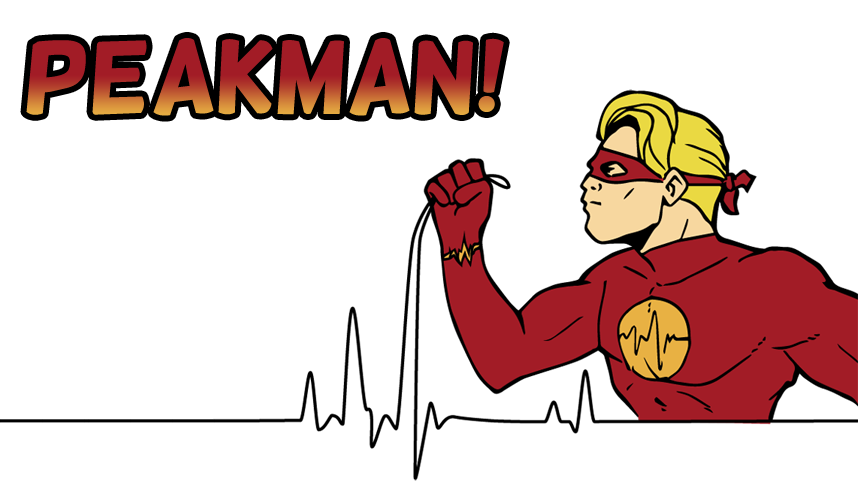
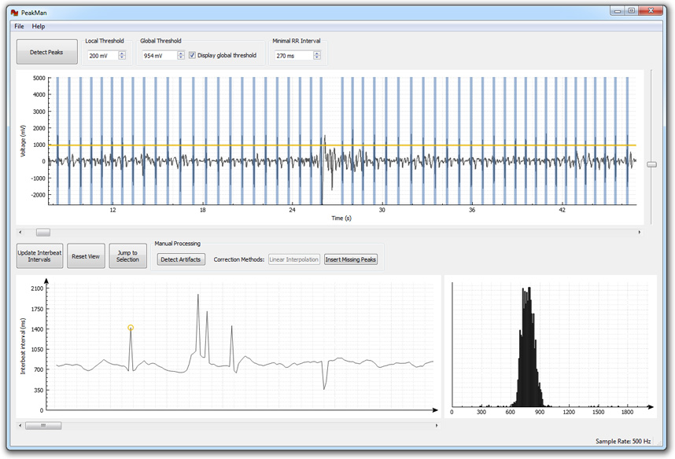

PeakMan is an easy-to-use and fast peak detection and artifact processing tool for electrocardiogram data.

It builds upon a [peak detection algorithm](http://www.billauer.co.il/peakdet.html) by Eli Billauer and features local and global thresholding for R wave detection.

The application is written in C++ using the Qt framework and runs on all major platforms (Windows, Mac OS X and Linux). [QCustomPlot](http://qcustomplot.com/) is used for data visualization.

## Building from source

If you want to build PeakMan from source you need to have Qt 5.x ([qt.io](http://www.qt.io/download/)) installed. The easiest way then is to open the `peakman.pro` file in the `src` folder with Qt Creator and compile PeakMan from there.

## Windows
Be sure to install gcc together with Qt.

## Mac OS X
You need to have Xcode installed.

## Linux
You might need to install further dependencies such as `mesa-common-dev` (build error `fatal error: GL/gl.h: No such file or directory`) or `libgl1-mesa-dev` (build error `cannot find -lGL`).
